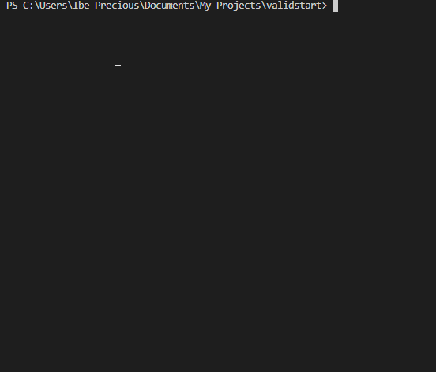

# 📦 ValidStart

**ValidStart** is a powerful yet simple CLI tool designed to help you scaffold any kind of software project — fast.

Whether you're building a frontend website, backend API, fullstack app, CLI tool, or even a reusable library/package, ValidStart eliminates the repetitive setup process. No more digging through documentation or manually setting up folders — just answer a few questions and your project is ready to go.

---

## ✅ What Does It Do?

ValidStart automates the boilerplate setup for new projects. It:

- Lets you select the **project type**: Frontend, Backend, Fullstack, CLI tool, or Library
- Supports multiple **languages**: JavaScript, TypeScript, Python, Go, Rust, Java, PHP, HTML/CSS
- Offers popular **frameworks**: React, Vue, Next.js, Django, Laravel, Spring Boot, and more
- Adds **extra tools/libraries** as needed
- Automatically creates:
  - Project folder structure
  - Initial files (`README.md`, `.gitignore`, `.env`, `install.sh`, etc.)
  - Installs relevant dependencies
  - Initializes a Git repository

You get a ready-to-code project in **seconds**.

---

## 🚀 Quick Install (Recommended)

```bash
npm install -g validstart
```

Make sure you have Node.js installed (see below if you don't).

Once installed, you can use the `validstart` command from anywhere on your machine.

---

## 🧰 Don’t Have Node.js?

No problem. Here’s how to install it in a beginner-friendly way:

### 🔧 Step-by-Step for Windows/macOS/Linux:

1. Visit: https://nodejs.org
2. Click on the **LTS (Long Term Support)** version (recommended)
3. Download and run the installer
4. Follow the installation prompts
5. After installation, open a terminal or command prompt and run:

```bash
node -v
npm -v
```

If both show version numbers, you're good to go.

---

## 🧪 Verify Installation

Once you’ve installed Node.js and ValidStart, run:

```bash
validstart hello
```

You should see:

```bash
✅ Hello from ValidStart!
```

## 🎥 CLI Demo



---

## 📁 Create a New Project

To start a new project, run:

```bash
validstart init
```

You’ll be guided through a few questions:

- 📛 What’s your project name?
- ⚙️ What kind of project? (Frontend, Backend, etc.)
- 🧑‍💻 Which programming language?
- 🧱 Which framework?
- 🧩 Any additional tools/libraries?
- 📄 Should it include helper files like `.gitignore`, `README.md`, etc.?

Then ValidStart will:

- Create the right folder structure
- Generate starter code
- Install dependencies
- Initialize a Git repository

---

## 🧑‍💻 For Developers & Contributors

Want to contribute or work on ValidStart locally? Follow these steps:

### 🔧 Clone and Build Locally:

```bash
git clone https://github.com/thevalidcode/validstart.git
cd validstart
npm install
npm run build
```

### ▶️ Run Locally Without Global Install:

```bash
node dist/index.js init
```

### 🔗 Link Globally for Development:

```bash
npm link
validstart init
```

---

## 📥 Contribution Guidelines

We welcome contributions! To maintain a clean and professional workflow, please follow these steps:

1. **Fork the Repository**

   Go to https://github.com/thevalidcode/validstart and click **Fork**.

2. **Clone Your Fork**

   ```bash
   git clone https://github.com/YOUR_USERNAME/validstart.git
   cd validstart
   ```

3. **Create a New Branch**

   ```bash
   git checkout -b feature/my-new-feature
   ```

4. **Make Your Changes**

5. **Test Your Changes**

   Ensure everything works locally by running:

   ```bash
   npm run build
   node dist/index.js
   ```

6. **Commit Your Work**

   ```bash
   git add .
   git commit -m "feat: added my new feature"
   git push origin feature/my-new-feature
   ```

7. **Open a Pull Request**

   Go back to GitHub and open a PR from your branch.

> ✅ Follow the Conventional Commits style: `feat:`, `fix:`, `chore:`, etc.

---

## 🔨 Built With

ValidStart uses modern tools to deliver a fast and flexible developer experience:

- **Node.js** – Cross-platform runtime
- **TypeScript** – Type-safe development
- **Commander.js** – Command-line interface parsing
- **Inquirer.js** – Interactive prompts
- **Execa** – Shell command execution
- **Chalk** – Styled terminal output
- **fs-extra** – File handling utilities

---

## 📄 License

This project is licensed under the **ISC License** — free for personal and commercial use.

---

## 👤 Author

**Ibeh Precious (Valid)**

- GitHub: [@thevalidcode](https://github.com/thevalidcode)
- Twitter: [@thevalidcode](https://twitter.com/thevalidcode)
- LinkedIn: [@thevalidcode](https://linkedin.com/in/thevalidcode)

---

> 💬 Have ideas or suggestions? Open an issue or reach out on social media.
